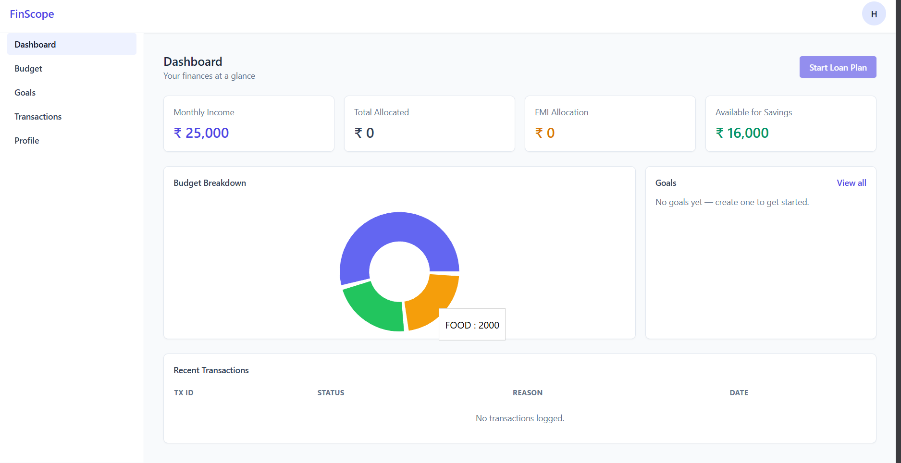

# 🌐 **FinScope**

### *Your Personal Finance Command Center*

FinScope is a modular, scalable personal finance backend built with **Spring Boot**, designed around **Feature-Based Modular Architecture**

It provides clean REST APIs for users, budgets, goals, loans, and distributed transaction coordination — built to demonstrate real-world backend engineering skills.

---

# ✨ **Core Features**

### 🧾 **User & Income Management**

* Create users
* Set & fetch monthly income

### 💸 **Budget Management**

* Add/update budget categories
* Track allocations
* Enforce EMI rules (≤ 40% of income)
* Supports **Two-Phase Commit (Prepare → Commit/Rollback)**

### 🎯 **Goals & Loan Planning**

* Create financial goals
* Compute EMI using bank-style formula
* Create loan plans
* Supports 2PC for safe distributed updates

### 🔗 **Transaction Coordinator (2PC Engine)**

* Implements **Prepare–Commit–Rollback** flows across Budget and Loan services
* Ensures atomic updates across multiple services
* Logs all transactions in a dedicated table

### 🗃️ **Transaction Logs API**

* View all transactions
* Filter by user or transaction ID

### 🧱 **Architecture Strengths**

* Feature-based modular structure
* Domain separation (User, Budget, Goal, Coordinator)
* Clear boundaries & easy maintainability
* Ready for microservices migration

---

# 🛠️ **Tech Stack**

| Layer                  | Technology                         |
| ---------------------- | ---------------------------------- |
| **Backend**            | Java, Spring Boot                  |
| **Build Tool**         | Maven                              |
| **Database**           | MySQL / H2 (dev)                   |
| **Architecture Style** | Feature-Based Modular Architecture |
| **Transaction Model**  | Two-Phase Commit (2PC)             |

---

# 🧱 **Architecture: Feature-Based Modular Structure**

FinScope follows a **Package-by-Feature** approach, where each domain contains its own:

* Controller
* Service
* Repository
* Model

This approach ensures:

* High isolation of features
* Natural alignment with business domains
* Easier onboarding for new developers
* Better scalability and maintainability
* Natural path to microservices

---

# 📁 **Project Structure**

```
FinScope/
 ├── src/
 │   ├── main/java/com/finscope/
 │   │
 │   │── budget/
 │   │     ├── controller/
 │   │     ├── service/
 │   │     ├── repository/
 │   │     └── model/
 │   │
 │   │── coordinator/
 │   │     ├── controller/
 │   │     ├── service/
 │   │     ├── repository/
 │   │     └── model/
 │   │
 │   │── goal/
 │   │     ├── controller/
 │   │     ├── service/
 │   │     ├── repository/
 │   │     └── model/
 │   │
 │   │── user/
 │   │     ├── controller/
 │   │     ├── service/
 │   │     ├── repository/
 │   │     └── model/
 │   │
 │   └── resources/
 │         └── application.properties
 │
 ├── pom.xml
 └── README.md
```

---

# 🔗 **API Overview**

## 💸 **Budget APIs**

| Method | Endpoint               | Description                         |
| ------ | ---------------------- | ----------------------------------- |
| `GET`  | `/api/budget/{userId}` | Fetch budget allocations for a user |
| `POST` | `/api/budget/{userId}` | Create/update a budget category     |
| `POST` | `/api/budget/prepare`  | Phase 1: Prepare a change (2PC)     |
| `POST` | `/api/budget/commit`   | Phase 2: Commit staged changes      |
| `POST` | `/api/budget/rollback` | Phase 2: Rollback staged changes    |

---

## 🔗 **Coordinator APIs (Two-Phase Commit Engine)**

| Method | Endpoint                     | Description                              |
| ------ | ---------------------------- | ---------------------------------------- |
| `POST` | `/api/tx/start-loan-plan`    | Start distributed loan transaction (2PC) |
| `GET`  | `/api/tx/logs`               | Get all transaction logs                 |
| `GET`  | `/api/tx/logs/user/{userId}` | Get logs for a specific user             |
| `GET`  | `/api/tx/logs/{txId}`        | Get logs by transaction ID               |

---

## 🎯 **Goal APIs**

| Method | Endpoint                   | Description                               |
| ------ | -------------------------- | ----------------------------------------- |
| `POST` | `/api/goals`               | Create a financial goal                   |
| `POST` | `/api/goals/loan`          | Create loan plan (direct EMI calculation) |
| `GET`  | `/api/goals/{goalId}/loan` | Fetch loan plan for a goal                |
| `POST` | `/api/goals/loan/prepare`  | Prepare loan update (2PC)                 |
| `POST` | `/api/goals/loan/commit`   | Commit loan update                        |
| `POST` | `/api/goals/loan/rollback` | Rollback loan update                      |

---

## 👤 **User APIs**

| Method | Endpoint                     | Description               |
| ------ | ---------------------------- | ------------------------- |
| `POST` | `/api/users`                 | Create user               |
| `POST` | `/api/users/{userId}/income` | Set/update monthly income |
| `GET`  | `/api/users/{userId}/income` | Get monthly income        |

---

# ⚙️ **Setup & Installation**

### 1️⃣ Clone the repository

```bash
git clone https://github.com/hricha11/FinScope.git
cd FinScope
```

---

### 2️⃣ Configure the database (MySQL)

In `src/main/resources/application.properties`:

```properties
spring.datasource.url=jdbc:mysql://localhost:3306/finscope
spring.datasource.username=YOUR_USERNAME
spring.datasource.password=YOUR_PASSWORD

spring.jpa.hibernate.ddl-auto=update
spring.jpa.show-sql=true
```

---

### 3️⃣ Run the application

```bash
mvn spring-boot:run
```

---

# 📊 **Future Enhancements**

* 🔐 JWT Authentication
* 📈 Insights Dashboard API
* 🧮 Savings & Investment Module
* 💳 Expense Tracking
* 📊 Aggregated Reporting
* 📉 AI-driven financial advice

---

# 🤝 **Contributing**

Pull requests, optimizations, and suggestions are welcome!

If you build a feature, follow the same **feature-based modular structure**.

---

# 🏁 **FinScope — Turning Personal Finance Into Precision Engineering**
